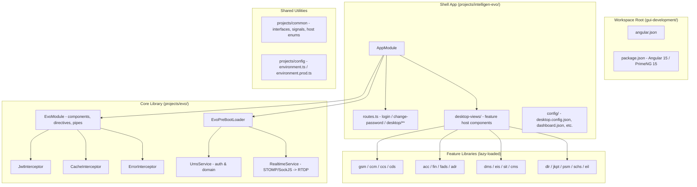
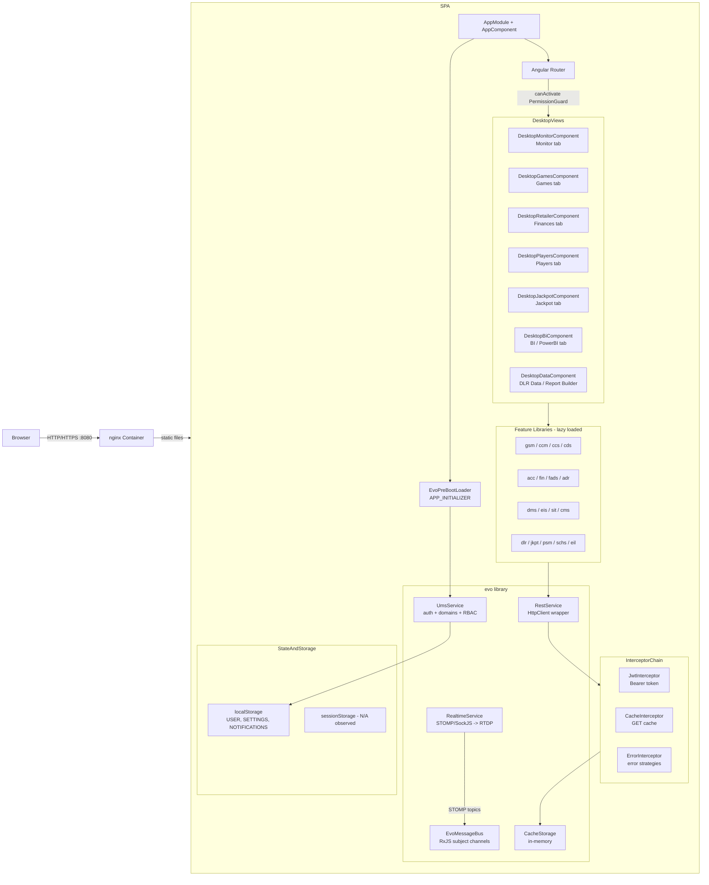
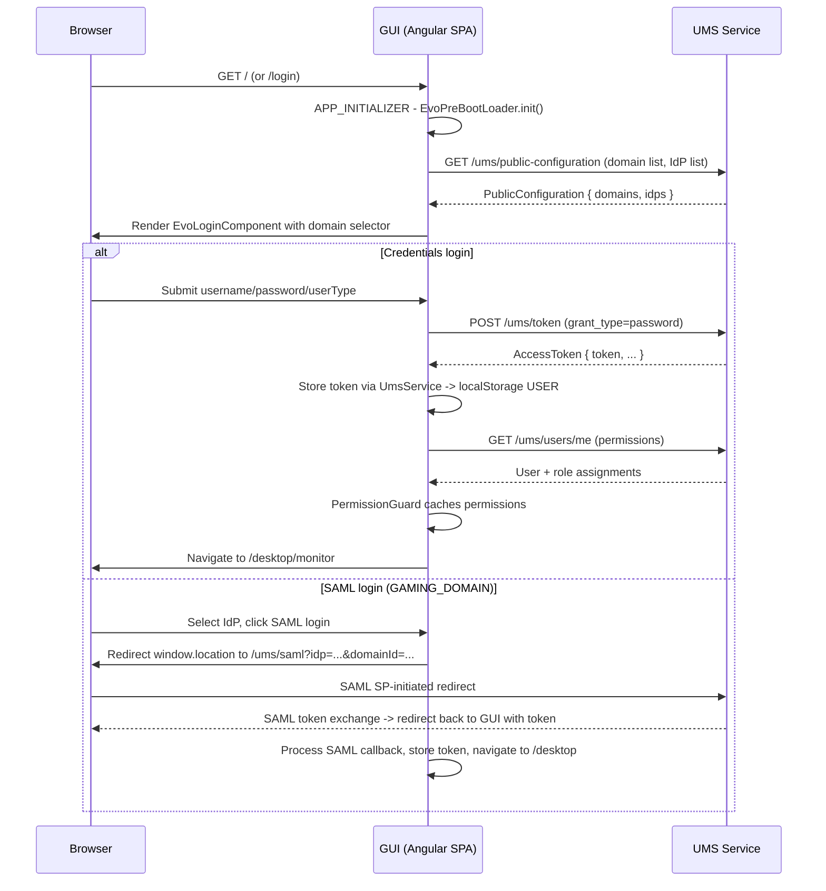
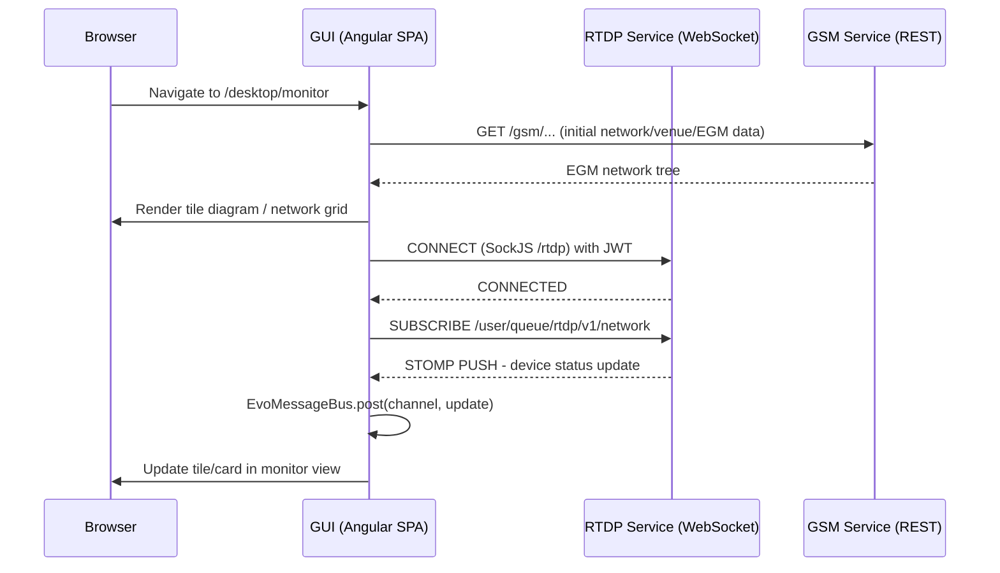

## Module: GUI Host Service (GUI)

### 6.1 Purpose

The GUI Host Service is the operator/back-office web UI for the entire IntelligenEVO platform. It is a single Angular 15 SPA (project name `intelligen-evo`) served by an nginx container on port 8080. Operators use it to monitor gaming networks, manage EGMs and venues, administer users/roles, view financial and accounting data, manage jackpots and player services, and run BI/data reports. It acts purely as a consumer of the platform's REST and WebSocket APIs — it owns no server-side database.

Source: `gui-development/package.json`, `gui-development/projects/intelligen-evo/src/app/app.module.ts`, `gui-development/README.md`.

---

### 6.2 Code Structure

Angular 15 monorepo workspace (single `intelligen-evo` application; all feature code lives in `projects/` as Angular libraries). There is **no Webpack Module Federation / micro-frontend split** — all feature libraries are compiled together into one SPA bundle. Module lazy-loading is used for feature routes.

**Angular workspace projects (from `angular.json`):**

| Project | Type | Notes |
|---|---|---|
| `intelligen-evo` | application | Shell app, routes, AppModule |
| `evo` | library | Core framework: interceptors, services, UI components, UMS, realtime |
| `common` | library | Shared interfaces, signals, host-service enums |
| `gsm` | library | Gaming Site Management feature module |
| `ccm` | library | Casino Configuration Management feature module |
| `ccs` | library | Casino Control System feature module |
| `cds` | library | Casino Data Service feature module |
| `eil` | library | (registered in angular.json) |
| `schs` | library | Scheduling service feature module |
| `idr` | library | (registered in angular.json) |
| `shared` | library | Cross-feature shared components |
| `mocks` | library | Local JSON-server mock backend (dev only) |

**Additional projects in `projects/` directory (not in angular.json — built as npm libs or separate processes):**

`acc`, `adr`, `cms`, `dlr`, `dms`, `eis`, `fads`, `fin`, `jkpt`, `psm`, `sit`, `schs`, `eil`

These are lazily-imported Angular feature modules registered by string token in `AppModule`'s `EVO_MODULES` map.

---

### 6.3 Responsibilities

- Render the operator back-office UI for all EVO platform domains.
- Authenticate operators (username/password via UMS REST; SAML/IdP redirect for GAMING_DOMAIN users).
- Domain selection at login; guard routes by RBAC permission from UMS.
- Provide desktop-style multi-panel UI: Dashboard, Action Panel, Details Panel, Search Panel, Report Panel per functional area (Monitor, Games, Finances, Players, Jackpot, BI, Data).
- Consume REST APIs of all backend services and render their data in filterable tables, tile diagrams, form editors, and reports.
- Subscribe to RTDP WebSocket (STOMP over SockJS) for real-time EGM network and SIT alert updates.
- Export data to Excel/CSV via `exceljs`/`json2csv`.
- Embed PowerBI reports (`powerbi-client-angular`).
- Provide an AI chat interface against the `/chat/v1` service.
- Served via nginx as a static SPA (all routing is client-side; nginx falls back to `index.html`).

---

### 6.4 Public Interfaces

The GUI **serves** the browser UI (no REST API exposed). It **consumes** the following backend services:

| Backend Service | Route Prefix | Feature Area | Evidence |
|---|---|---|---|
| UMS | `/ums/*` | Auth, users, roles, domains | `proxy.conf.mjs`, `jwt.interceptor.ts`, `ums.service.ts` |
| GSM | `/gsm` | Gaming Site Mgmt (venues, EGMs, VSCs) | `proxy.conf.mjs`, `app.module.ts` moduleMap |
| CCM | `/ccm/v1/*` | Casino Configuration Mgmt | `proxy.conf.mjs`, moduleMap |
| CCS | `/ccs/v1/*` | Casino Control System | `proxy.conf.mjs`, moduleMap |
| CDS | `/cds/v1/*` | Casino Data Service | `proxy.conf.mjs`, moduleMap |
| DCM | `/dcm/v1/*` | Device Configuration Mgmt | `proxy.conf.mjs` |
| DMS | `/dms/v1/*` | Document Management | `proxy.conf.mjs`, moduleMap |
| EIS | `/eis/*` | EGM Info Service | `proxy.conf.mjs`, moduleMap |
| FIN | `/fin/v1/*` | Financial Transactions | `proxy.conf.mjs`, moduleMap |
| ACC | `/acc/v1/*` | Accounting | `proxy.conf.mjs`, moduleMap |
| ADR | `/adr/v1/*` | Audit/Document Reporting | `proxy.conf.mjs`, moduleMap |
| FADS | `/fads/v1/*` | Financial Analytics Data Service | `proxy.conf.mjs`, moduleMap |
| SCCM | `/sccm/v1/*` | Site Controller Config Mgmt | `proxy.conf.mjs` |
| JKPT | `/jkpt/v1/*` | Jackpot | `proxy.conf.mjs`, moduleMap |
| CMS | `/cms/v1/*` | Cash Management System | `proxy.conf.mjs`, moduleMap |
| DLR | `/dlr/v1/*` | Data Layer Reporting | `proxy.conf.mjs`, moduleMap |
| SIT | `/sit/*` | Situation Management | `proxy.conf.mjs`, moduleMap |
| EIL | *(eil)* | (module registered; no dedicated proxy entry found) | `app.module.ts` moduleMap |
| SCHS | `/schs/v1/*` | Scheduling | `proxy.conf.mjs`, moduleMap |
| RTDP | `/rtdp/*` | Real-time Data Push (WebSocket/STOMP) | `proxy.conf.mjs` (ws:true), `realtime.service.ts` |
| GHS | `/ghs/*` | **Unconfirmed** — Game History Service? | `proxy.conf.mjs`, `autodiscover.json` |
| PSM | *(psm)* | Player Session Mgmt (**Inference**) | moduleMap only |
| Chat / AI | `/chat/v1/*` | AI Chat interface | `proxy.conf.mjs`, `ai-chat.service.ts` |
| PlaySmart | `/playsmart/v1/*` | Player Smart (**Inference**) | `proxy.conf.mjs` |
| PlayAccounts | `/playaccounts/*` | Player Accounts | `proxy.conf.mjs` |
| PlaySessions | `/playsessions/v1/*` | Player Sessions | `proxy.conf.mjs` |
| PlayRewards | `/playrewards/v1/*` | Player Rewards | `proxy.conf.mjs` |
| PlayWallets | `/playwallets/v1/*` | Player Wallets | `proxy.conf.mjs` |
| PlPay | `/plpay/v1/*` | Player Pay | `proxy.conf.mjs` |
| PlayLogs | `/playlogs/*` | Play Logs | `proxy.conf.mjs` |
| PlayChannel | `/playchannel/*` | Play Channel | `proxy.conf.mjs` |
| PlSit | `/plsit/v1/*` | Player Situation (**Inference**) | `proxy.conf.mjs` |
| MysteryDraw | `/mysterydraw/v1/*` | Mystery Draw | `proxy.conf.mjs` |

All service endpoints are resolved at runtime from `autodiscover.json` (mounted via Kubernetes ConfigMap `evo-discovery` in production). In dev, they are proxied via per-environment proxy configs.

---

### 6.5 Internal Components

---

### 6.6 Key Runtime Flows

#### 6.6.1 Login / Auth + Domain Selection

#### 6.6.2 Real-time Monitor View

---

### 6.7 Data Model / Persistence

The GUI owns **no server-side database**. Client-side persistence:

| Store | Key(s) | Content | Evidence |
|---|---|---|---|
| `localStorage` | `USER` | Serialized user object + JWT token | `local-storage-item.enum.ts` |
| `localStorage` | `SETTINGS` | User UI settings/preferences | `local-storage-item.enum.ts` |
| `localStorage` | `PENDING_SETTINGS` | Uncommitted settings changes | `local-storage-item.enum.ts` |
| `localStorage` | `NOTIFICATIONS` | Notification cache | `local-storage-item.enum.ts` |
| In-memory `CacheStorage` | URL-keyed | HTTP GET response cache (TTL-aware) | `cache-storage.ts`, `cache.interceptor.ts` |

No NgRx state management found — the app uses RxJS service-based state (`ReplaySubject`, `BehaviorSubject` in UmsService, EvoMessageBus, DesktopManager) plus PrimeNG's local component state. **No session storage usage observed** (Needs validation).

---

### 6.8 Dependencies

#### Compile-time / Framework
| Dependency | Version | Role |
|---|---|---|
| `@angular/core` | 15.2.8 | Framework |
| `@angular/router` | 15.2.8 | Client-side routing |
| `primeng` | 15.3.0 | UI component library |
| `primeflex` / `primeicons` | 2.x / 6.x | PrimeNG layout/icons |
| `@angular/cdk` | 15.2.8 | Component Dev Kit |
| `rxjs` | ~6.6.3 | Reactive programming |
| `@ngx-translate/core` | ^11.0.1 | i18n |
| `@stomp/stompjs` | ^6.1.2 | STOMP over WebSocket |
| `sockjs-client` | ^1.5.2 | WebSocket fallback transport |
| `powerbi-client-angular` | ^3.0.5 | Embedded PowerBI |
| `exceljs` / `json2csv` | ^4.3 / ^5.0 | Data export |
| `cytoscape` | ^3.14.1 | Network graph visualization |
| `dayjs` | ^1.11.5 | Date utilities |
| `lodash-es` | ^4.17.21 | Utility functions |
| `ngx-translate` | ^11.0.1 | i18n |
| `samlify` | ^2.10.2 (devDep) | Mock SAML server (dev only) |

#### Runtime / Infrastructure
| Dependency | Notes |
|---|---|
| nginx (unprivileged) | Serves static SPA on port 8080 |
| Kubernetes / Helm chart `charts/gui/` | Deployment, Service (ClusterIP :8080), HPA-capable |
| `evo-discovery` ConfigMap | Mounted at `/autodiscover/autodiscover.json` — provides live backend service URLs |
| nginx `conf.d` ConfigMap | Injected via Helm for environment-specific nginx settings |

#### Backend Services Consumed
UMS, GSM, CCM, CCS, CDS, DCM, DMS, EIS, FIN, ACC, ADR, FADS, SCCM, JKPT, CMS, DLR, SIT, SCHS, EIL, RTDP (WS), GHS, PSM, Chat/AI, PlaySmart, PlayAccounts, PlaySessions, PlayRewards, PlayWallets, PlPay, PlayLogs, PlayChannel, PlSit, MysteryDraw. (See §6.4 for full table.)

#### External
- PowerBI cloud (embedded reports via `powerbi-client-angular`)
- Font Awesome 5 (icons)

---

### 6.9 Configuration & Deployment Notes

**Environment / API base URL config:**
- Dev: `projects/config/src/environment.ts` (logLevel=5, production=false, no base URLs hardcoded)
- Prod: `projects/config/src/environment.prod.ts` (production=true)
- Runtime URL resolution via `autodiscover.json` — in production this file is a symlink to a ConfigMap volume mount (`/autodiscover/autodiscover.json`) containing live service endpoints. In dev/CI it is a static file with `localhost:4200` proxy entries.

**Proxy configs (dev serve only):**
Multiple environment-specific proxy files (`proxy.conf.mjs`, `proxy.dev.conf.json`, `proxy.ri.conf.json`, etc.) pointing at named cluster environments (e.g., `evo.rc.igt.intelligen-evo.com`). The `proxy.conf.mjs` is the default dev proxy.

**nginx:**
- Listens on `:8080` (non-privileged)
- `try_files $uri $uri/ /index.html` — standard SPA fallback
- JS files get `max-age=86400` cache header; HTML/other assets get `max-age=0`
- `conf.d/additionalServerSettings.conf` is injected by Helm for environment overrides (currently empty in repo)
- `client_max_body_size 16m`

**Container / Helm:**
- Docker: multi-stage build; nginx-unprivileged base; `dist/intelligen-evo/` copied to `/html/`
- Service: ClusterIP, port 8080; label `evo-monitoring.igt.com/type: evo-gui`
- Resources: 50m–500m CPU, 20–100Mi RAM
- HPA: disabled by default (configurable to 2–6 replicas)
- Deployment annotation: `reloader.stakater.com/search: "true"` — auto-redeploy on ConfigMap change
- `evo-discovery.igt.com/discoverable: "true"` — service discovery registration

**CI/CD:**
- Jenkins pipeline (`Jenkinsfile`): agent `jenkins-nodejs24`; stages for DLR vitest, CI snapshot build, release build
- Skaffold (`skaffold.yaml`) for local Kubernetes development
- Build command: `ng build intelligen-evo --configuration production` with `NODE_OPTIONS=--max_old_space_size=6144` (large bundle)
- Tests: Jest (unit, `--runInBand` for CI), Vitest (dlr, cms, eis, fads, fin, jkpt, sit modules), Karma (legacy Angular component tests)
- E2E: `gui-e2e-tests/` (Cucumber/Maven-based, separate from Jest)

---

### 6.10 Risks / Gaps / Questions

1. **Bundle size concern**: `NODE_OPTIONS=--max_old_space_size=6144` and a 6 MB error budget suggest a very large bundle. All feature modules are compiled together despite lazy-loading — Module Federation could reduce initial load. Evidence: `angular.json` build budgets, `package.json` build script.

2. **No Module Federation**: Despite being labeled a "micro-frontend" platform, the GUI is a monolithic Angular build. All 16+ feature libraries are compiled into one application. Breaking them out would require significant refactoring. **Needs validation** — check if any plans exist in `plans/`.

3. **Many backend service dependencies**: The GUI proxies ~30 backend services. Any service API change may require a GUI update. No API contract tests (e.g., Pact) observed.

4. **`BackendServiceName` enum is incomplete**: Only lists GSM, UMS, CCM, GUI, DMS, FIN — does not cover all proxied services. May cause gaps in service-level error routing. Evidence: `backend-services.enum.ts`.

5. **SAML mock uses hardcoded localhost IP**: `proxy.conf.json` entry for `/pdfs` points to `192.168.0.129:8080` — likely a developer's local machine address, not a hostname. **Needs validation** that this does not leak into production configs.

6. **Empty `additionalServerSettings.conf`**: The nginx conf.d override file is a single blank line in the repo; production settings are applied via Helm ConfigMap. The default nginx config has no TLS termination, CORS headers, or security headers configured (these may be added by ingress or the ConfigMap — **Unconfirmed**).

7. **No NgRx / formal state management**: State is managed via RxJS service subjects and `localStorage`. This can lead to consistency issues under complex concurrent user interactions. **Inference** — not necessarily a risk if the existing pattern is working.

8. **GHS service**: `ghs` appears in proxy config and autodiscover but has no dedicated feature module in `app.module.ts` moduleMap. Purpose unclear. **Needs validation**.

9. **`samlify` in devDependencies**: Used for mock SAML server. Ensure it is never included in production builds.

10. **AI Chat feature (`/chat/v1`)**: Present in proxy config and `ai-chat.service.ts` but no corresponding `chat` module in `app.module.ts` moduleMap — likely consumed directly from the `evo` library. Production readiness and data classification of chat history storage **Needs validation**.

---

### 6.11 Documentation Confidence

**M (Medium)**

The proxy configuration, `app.module.ts` feature module map, routing definitions, interceptors, service discovery (autodiscover.json), Helm values, and Dockerfile are all directly readable and provide high confidence for architecture, deployment, and backend service consumption. Angular library project structure is clear.

Gaps that reduce confidence to Medium:
- The `projects/` directory contains ~20 feature libraries whose internal API call patterns were sampled (gsm, acc, dlr) but not fully read — the complete set of REST endpoints called per module is not enumerated here.
- The `plans/`, `help/`, and `apl-data/` directories were not inspected (could contain relevant architectural decisions).
- Production nginx `conf.d` overrides are runtime-injected and not visible in the repo.
- The relationship between some proxy-config services (GHS, PSM, plsmart, etc.) and in-repo feature modules is not fully mapped.
