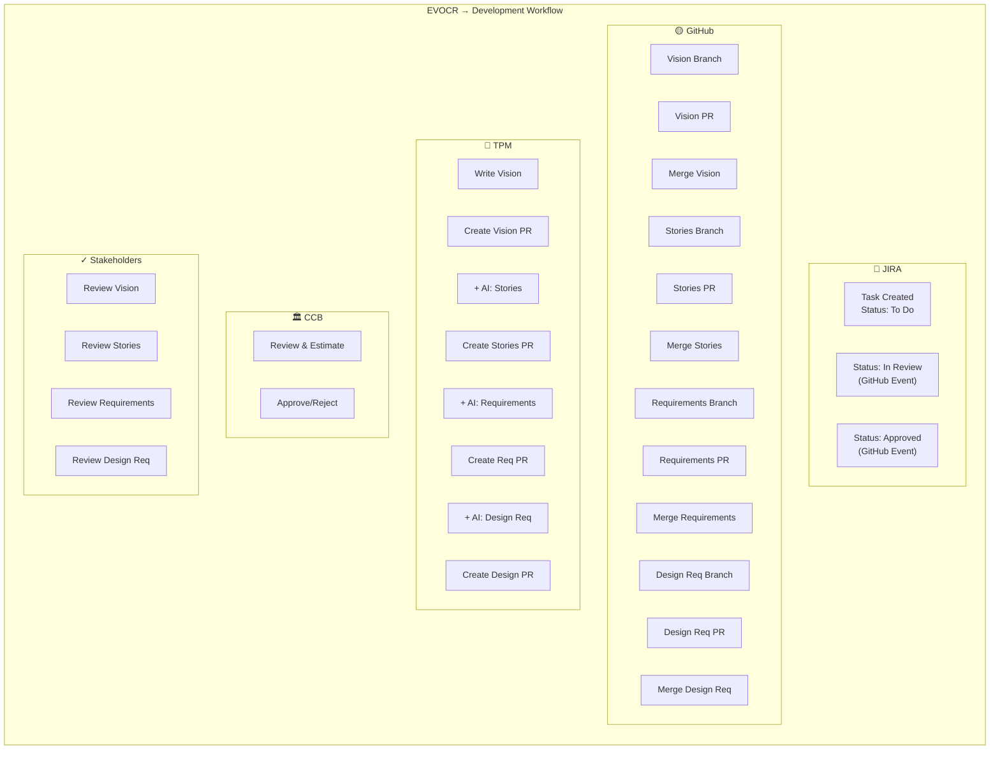

# EVOCR Swimlane Workflow

## Process Overview

This document illustrates the EVOCR (EVO Change Request) to Development workflow across multiple systems and roles using a swimlane diagram. The workflow shows how product vision, user stories, and requirements flow through review cycles with automated GitHub-JIRA integration.

---

## Swimlane Diagram

```mermaid
graph TD
    Start([Project Start]) --> Step1["EVO CR Logged"]
    
    Step1 --> Step2["EVOPROD Auto-Created<br/>(BRSNOW Component)"]
    Step2 --> Step3["3 Sub-Tasks Created:<br/>• Vision<br/>• Stories<br/>• Requirements<br/>Status: To Do"]
    
    subgraph "Product Vision Cycle"
        Step4a["TPM: Create Vision<br/>GitHub Branch<br/>(JIRA Linked)"]
        Step5a["TPM: Write Vision<br/>Markdown"]
        Step6a["TPM: Create<br/>Vision PR"]
        Step7a["GitHub: Auto-Set<br/>Status → In Review"]
        Step8a{Vision<br/>Approved?}
        Step9a["GitHub: Auto-Set<br/>Status → Approved"]
        
        Step4a --> Step5a --> Step6a --> Step7a --> Step8a
        Step8a -->|No| Step5a
        Step8a -->|Yes| Step9a
    end
    
    Step3 --> Step4a
    
    Step9a --> Step10["EVOCR → CCB<br/>Estimation"]
    
    subgraph "CCB Gate"
        Step11["CCB: Review & Estimate<br/>EVOCR"]
        CCBDecision{Approved?}
        NoGo["Not Approved<br/>End Flow"]
        Step11b["Assign to TPM<br/>User Stories"]
        
        Step11 --> CCBDecision
        CCBDecision -->|No| NoGo
        CCBDecision -->|Yes| Step11b
    end
    
    Step10 --> Step11
    
    subgraph "User Stories Cycle"
        Step12b["TPM: Create Stories<br/>GitHub Branch<br/>(JIRA Linked)"]
        Step13b["TPM + AI: Generate<br/>Stories Markdown"]
        Step14b["TPM: Create<br/>Stories PR"]
        Step15b["GitHub: Auto-Set<br/>Status → In Review"]
        Step16b{Stories<br/>Approved?}
        Step17b["GitHub: Auto-Set<br/>Status → Approved"]
        
        Step12b --> Step13b --> Step14b --> Step15b --> Step16b
        Step16b -->|No| Step13b
        Step16b -->|Yes| Step17b
    end
    
    Step11b --> Step12b
    
    Step17b --> Step18["Architecture Design<br/>Begins"]
    
    subgraph "Requirements Cycle"
        Step19c["TPM: Create Requirements<br/>GitHub Branch<br/>(JIRA Linked)"]
        Step20c["TPM + AI: Generate<br/>Requirements Markdown"]
        Step21c["TPM: Create<br/>Requirements PR"]
        Step22c["GitHub: Auto-Set<br/>Status → In Review"]
        Step23c{Requirements<br/>Approved?}
        Step24c["GitHub: Auto-Set<br/>Status → Approved"]
        
        Step19c --> Step20c --> Step21c --> Step22c --> Step23c
        Step23c -->|No| Step20c
        Step23c -->|Yes| Step24c
    end
    
    Step18 --> Step19c
    
    Step24c --> Step25["Development Design<br/>Begins"]
    
    subgraph "Design Requirements Cycle"
        Step26d["TPM: Create Design Req<br/>GitHub Branch<br/>(JIRA Linked)"]
        Step27d["TPM + AI: Generate<br/>Design Req Markdown"]
        Step28d["TPM: Create<br/>Design Req PR"]
        Step29d["GitHub: Auto-Set<br/>Status → In Review"]
        Step30d{Design Req<br/>Approved?}
        Step31d["GitHub: Auto-Set<br/>Status → Approved"]
        
        Step26d --> Step27d --> Step28d --> Step29d --> Step30d
        Step30d -->|No| Step27d
        Step30d -->|Yes| Step31d
    end
    
    Step25 --> Step26d
    
    Step31d --> Step32["UI Design<br/>Begins"]
    Step32 --> Step33["TPM Supports<br/>SDLC Teams"]
    Step33 --> End([End])
    
    NoGo --> End
    
    style Start fill:#90EE90
    style End fill:#FFB6C6
    style NoGo fill:#FFB6C6
    style Step11 fill:#FFD700
    style CCBDecision fill:#FFD700
    style Step8a fill:#87CEEB
    style Step16b fill:#87CEEB
    style Step23c fill:#87CEEB
    style Step30d fill:#87CEEB
```



---

## Swimlane View: Role-Based Workflow

### Horizontal Swimlanes (Actors & Systems)



---

## Key Integration Points

### GitHub ↔ JIRA Automation

| Event | Trigger | Action | Result |
|-------|---------|--------|--------|
| PR Created | TPM opens pull request | GitHub webhook fires | JIRA task status → "In Review" |
| PR Approved + Merged | Stakeholder approves & merges | GitHub webhook fires | JIRA task status → "Approved" |
| Branch Naming | TPM creates branch `EVOPROD-###-*` | GitHub recognizes JIRA ID | Branch auto-linked to task |
| PR Comments | Reviewers comment in GitHub | Webhook syncs | Comments appear in JIRA |

---

## Status Progression

Each artifact follows this status lifecycle:

```
┌─────────────┐
│    To Do    │  ← Initial state
└──────┬──────┘
       │ PR Created
       ↓
┌─────────────┐
│  In Review  │  ← Stakeholders reviewing
└──────┬──────┘
       │ Changes Requested
       ├──────────→ (Return to To Do for revisions)
       │
       │ PR Approved
       ↓
┌─────────────┐
│  Approved   │  ← Ready for next phase
└──────┬──────┘
       │
       ↓
┌─────────────┐
│   Closed    │  ← Phase complete
└─────────────┘
```

---

## Parallel Processing

Several phases can run in parallel:

- **Architecture Design** starts immediately after User Stories approval
- **Development Design** starts immediately after Requirements approval
- **UI/UX Design** starts immediately after Design Requirements approval

This allows for faster time-to-market and better utilization of cross-functional teams.

---

## CCB Gate Logic

```
EVOCR + Vision Approved
         ↓
    ┌────────┐
    │  CCB   │
    │ Review │
    └────────┘
    ↙         ↖
  No          Yes
  ↓           ↓
 END      Continue to
          User Stories
```

**CCB Evaluation Criteria:**
- Effort estimation
- Resource availability
- Risk assessment
- Strategic alignment
- Impact on existing systems
- Budget approval

---

## Artifacts & Locations

| Phase | Artifact | Branch Name | GitHub Path | Owner |
|-------|----------|-------------|-------------|-------|
| 1 | Product Vision | `EVOPROD-###-product-vision` | `/docs/product-vision.md` | TPM |
| 2 | User Stories | `EVOPROD-###-user-stories` | `/docs/user-stories.md` | TPM |
| 3 | Requirements | `EVOPROD-###-requirements` | `/docs/requirements.md` | TPM |
| 4 | Design Requirements | `EVOPROD-###-design-requirements` | `/docs/design-requirements.md` | TPM |

---

## Error Handling & Loops

### If Vision Rejected
- Stakeholders request changes in PR comments
- TPM updates Markdown in feature branch
- New commits auto-update PR
- Process repeats until approved

### If Stories Rejected
- Stakeholders request changes in PR comments
- TPM + AI refine stories
- New commits auto-update PR
- Process repeats until approved

### If CCB Rejects
- EVOCR marked as "Not Approved"
- Process ends
- Artifact stored for future consideration
- No further work authorized

### If Requirements Rejected
- Similar to Vision/Stories rejection loop
- TPM + AI refine requirements
- Process repeats until approved

### If Design Requirements Rejected
- Similar to previous rejection loop
- Process repeats until approved

---

## Success Metrics

✅ All PRs merged to main/develop branch  
✅ All JIRA tasks marked "Approved"  
✅ CCB provides green light  
✅ Artifacts are complete and testable  
✅ Design approach is technically feasible  
✅ Development team ready to begin  
✅ No open review comments in any PR  
✅ All automation webhooks firing correctly  

## Detailed Process Steps

### Phase 1: Initialization (Steps 1-3)

| Step | Activity | Owner | System | Output |
|------|----------|-------|--------|--------|
| 1 | EVO CR Logged | Change Requester | JIRA | EVOCR ticket created |
| 2 | EVOPROD Task Auto-Created | System | JIRA | EVOPROD parent task |
| 3 | Sub-Tasks Auto-Created | System | JIRA | Vision, Stories, Requirements tasks (Status: To Do) |

**Trigger**: Adding BRSNOW as a component type in JIRA automatically creates the task hierarchy.

---

### Phase 2: Product Vision Review Cycle (Steps 4-9)

| Step | Activity | Owner | System | Details |
|------|----------|-------|--------|---------|
| 4 | Create Branch | TPM | GitHub | Branch created from EVOPROD task link; JIRA-GitHub linked |
| 5 | Write Vision | TPM | GitHub | Markdown document captures problem, solution, scope, use cases |
| 6 | Create PR | TPM | GitHub | Pull request opens for stakeholder review |
| 7 | Status Update | System | JIRA | Webhook updates JIRA task to "In Review" |
| 8 | Review & Approve | Stakeholders | GitHub | Comments, approvals, or change requests |
| 9 | Status Update | System | JIRA | On merge, webhook updates JIRA task to "Approved" |

**Decision Gate**: Vision must be approved before proceeding to CCB.

---

### Phase 3: CCB Evaluation (Steps 10-11)

| Step | Activity | Owner | System | Criteria |
|------|----------|-------|--------|----------|
| 10 | Submit to CCB | TPM | JIRA | EVOCR escalated with approved Product Vision |
| 11 | CCB Review | CCB | JIRA | Effort estimation, resource availability, risk, alignment, impact |

**Decision Point**:
- **Not Approved** → End workflow, store EVOCR for future
- **Approved** → Assign to TPM for User Stories

---

### Phase 4: User Stories Review Cycle (Steps 12-17)

| Step | Activity | Owner | System | Details |
|------|----------|-------|--------|---------|
| 12 | Create Branch | TPM | GitHub | Branch created from EVOPROD task link |
| 13 | Generate Stories | TPM + AI | GitHub | AI assists in creating detailed user stories with acceptance criteria |
| 14 | Create PR | TPM | GitHub | Pull request opens for stakeholder review |
| 15 | Status Update | System | JIRA | Webhook updates JIRA task to "In Review" |
| 16 | Review & Approve | Stakeholders | GitHub | Comments, approvals, or refinements |
| 17 | Status Update | System | JIRA | On merge, webhook updates JIRA task to "Approved" |

**Next**: Triggers Architecture Design process parallel stream.

---

### Phase 5: Requirements Review Cycle (Steps 19-24)

| Step | Activity | Owner | System | Details |
|------|----------|-------|--------|---------|
| 19 | Create Branch | TPM | GitHub | Branch created from EVOPROD task link |
| 20 | Generate Requirements | TPM + AI | GitHub | AI assists in creating functional & non-functional requirements |
| 21 | Create PR | TPM | GitHub | Pull request opens for review |
| 22 | Status Update | System | JIRA | Webhook updates JIRA task to "In Review" |
| 23 | Review & Approve | Stakeholders | GitHub | Comments, approvals, or refinements |
| 24 | Status Update | System | JIRA | On merge, webhook updates JIRA task to "Approved" |

**Next**: Triggers Development Design process parallel stream.

---

### Phase 6: Design Requirements Review Cycle (Steps 26-31)

| Step | Activity | Owner | System | Details |
|------|----------|-------|--------|---------|
| 26 | Create Branch | TPM | GitHub | Branch created from EVOPROD task link |
| 27 | Generate Design Req | TPM + AI | GitHub | AI assists in creating technical design & architecture requirements |
| 28 | Create PR | TPM | GitHub | Pull request opens for architecture/design team review |
| 29 | Status Update | System | JIRA | Webhook updates JIRA task to "In Review" |
| 30 | Review & Approve | Architecture/Design | GitHub | Comments, approvals, or refinements |
| 31 | Status Update | System | JIRA | On merge, webhook updates JIRA task to "Approved" |

**Next**: Triggers UI/UX Design process.

---

### Phase 7: Implementation Handoff (Steps 32-33)

| Step | Activity | Owner | System | Details |
|------|----------|-------|--------|---------|
| 32 | UI Design Begins | UX/UI Team | External | Based on approved Design Requirements |
| 33 | TPM Support | TPM | All | Clarifications, scope management, blocking issues |

---